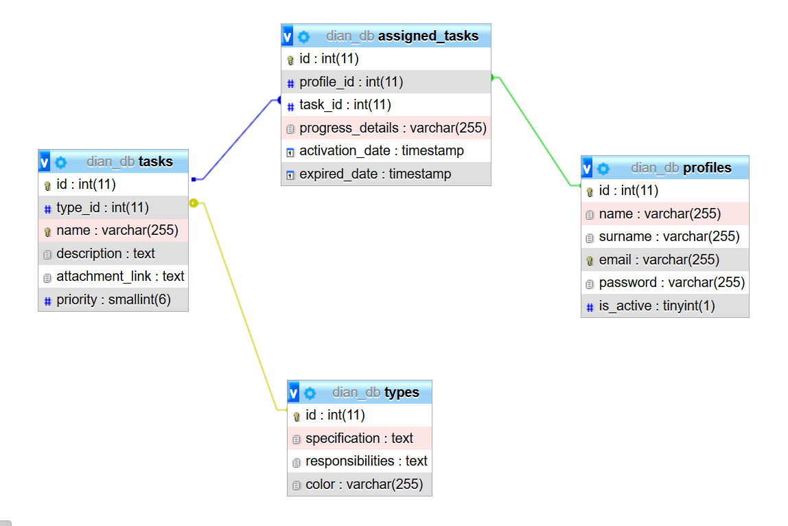

# Dianetello

Dianet company CRM

# Deployment guide

## Virtual environment

- Create in master dir:

  ```
  python -m venv venv
  ```

- Start:

  ```
  venv\Scripts\activate
  ```

- Stop:

  ```
  deactivate
  ```

## Install dependencies

- When you're running virtual env download files with pip:

  ```
  pip install mysql-connector-python
  ```

## Model

- More details abount database schema on: [data/model/schema.txt](./data/model/schema.txt) and [data/sql/create_tables.sql](./data/sql/create_tables.sql)

  

## Connecting to database

- You can use db_manager on [utils](./utils/db_manager/mysql_connector.py)

# Changelog

- 0.0.1 - root of application
- 0.0.2 - add simple project structure
- 0.0.3 - create database model to project
- 0.0.4 - add virtual env
- 0.0.5 - create connector util for MySQL
- 0.0.6 - preparing sample data to insert
- 0.0.7 - select data using app interface
- 0.0.8 - insert data using app interface
- 0.1.8 - create controllers for app
- 0.1.9 - support for all CRUD operations

# Preview

- 0.1.10 - create inititiation data files
- 0.2.10 - create sample command line user interface
- 0.3.11 - config virtual env for Django

# Problems and solutions:

## Windows:

- [PowerShell says “execution of scripts is disabled on this system.”](./hints/venv-windows-problem.md)

## Linux

# Contact and support

- Kamil Cecherz - kamil.c@dianet.pl
